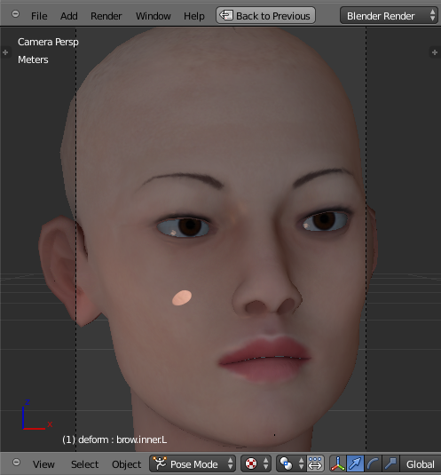

# OpenCog Docker library
This repository contains various docker images for demoing and using
various parts of the OpenCog project. Using the docker images here is
the easiest way to get interesting parts of OpenCog running.

By using Docker, most of the difficulty of installing and configuring
the large variety of required packages and dependencies is eliminated.
The individual docker files specify exactly what is needed to run a
system or demo.  Using these is as simple as saying `./build.sh` and
then `./run.sh`.

The most sophisticated demo is Eva, an animated female head, capable
of seeing you (via a webcam), talking to you (via a chatbot), and
engaging you (and your guests) in social interaction.  She will
make eye contact, and express her pleasure with smiles and looks
of surprise and happiness.

Another particularly interesting container is that for the OpenCog to
MineCraft bridge, which allows OpenCog to operate an avatar running
around in the MineCraft world.

## 1. Dockerfiles for Robot Operating System (ROS)
Dockerfiles for demoing and working with various different robot heads
and bodies, mostly those from Hanson Robotics. Several of the heads are
modeled with blender, and so can be usefully worked with and controlled
even without a physical robot.

Currently, the most sophisticated demo here is that of Eva, a female
head created by Hanson Robotics.  She can track human faces visible to
her (via webcam), interact by displaying a variety of emotions and
facial gestures, and perform lip sync for speech.  The Eva blender file
allows all this without the need of a physical robot head to be
available.

### Docker image structure:

    ├─ros-indigo-base
      ├─ros-indigo-blender
        ├─eva
        ├─ros-arthur-animation
        ├─ros-arthur-dev
        ├─ros-indigo-opencog
      ├─ros-indigo-dev
        ├─ros-indigo-einstein
        ├─ros-indigo-zenorsm

Images available at https://registry.hub.docker.com/repos/opencog/

Pull using, e.g., `docker pull ros-indigo-opencog`

### Organizational Notes:
The base and blender images should be general enough to allow various
different robots to be brought up and demoed.

* `ros-indigo-base` provides a base set of ROS packages, nothing more.
   The packages are sufficient for performing ROS demos, but no actual
   development.

* `ros-indigo-blender` adds blender to the base, thus allowing ROS nodes
   to control blender animations.

* `eva` provides the full Hanson Robotics Eva head demonstration. This
   includes vision and sound processing, motor controls, scripted
   behaviors, and a web user interface.  See the README in `indigo/eva`
   for more details.

* `ros-indigo-dev` provides additional development packages, allowing
   developers to build and test inside of docker containers. XXX
   this needs to be cleaned up and replaced by one of the above!?

## 2. Dockerfiles for OpenCog
The following are details about dockerfiles found in opencog and buildbot
directories. On how to use read [opencog's README.MD](opencog/README.md) and
[buildbot's README.md](buildbot/README.md).

The Dockerfiles in the directories `opencog/tools/distcc`, `opencog/embodiment` and `opencog/cogserver` are not detailed because they are not in active use.

### Docker image structure:

    ├─opencog/opencog-deps:utopic
    ├─opencog/opencog-deps:latest
      ├─buildbot_* (Where * = atomspace, cogutils, opencog, moses)
      ├─opencog/cogutils:latest
        ├─opencog/opencog-dev:cli (for a dev environment)
        ├─opencog/opencog-dev:ide
        ├─opencog/moses

    ├─opencog/relex

### Organizational Notes:

* `opencog/opencog-deps:utopic`: ubuntu 14.10 based image with all OpenCog's
   dependencies installed.

* `opencog/opencog-deps:latest`: ubuntu 14.04 based image with all OpenCog's
   dependencies installed. This forms the base of opencog/cogutils. It
   likely will be updated to the latest LTS as it is released. Has some command
   line tools for use by developers.

* `buildbot_*`: Is used for buildbot found [here](buildbot.opencog.org:8010)

* `opencog/cogutils`: It is the base image for `opencog/opencog-dev:cli`,
   `opencog/opencog-dev:ide` and `opencog/moses` images. It installs cogutils
   over `opencog/opencog-deps` image. The main reason for having this is to
   speed up rebuilds as one doesn't ave to rebuild the `opencog-deps` image,
   unless there are dependency changes, and rebuilding this image will suffice
   for updating the dependent images.

* `opencog/opencog-dev:cli`: Mainly for running/developing through a shared
   filesystem between host and container.

* `opencog/opencog-dev:ide`: To be used for developing using ides. QtCreator
   is installed.

* `opencog/moses`: It has moses and R installed. R is installed for those
   who want to use the R binding for moses. The binding is not yet included but can be found [here](https://github.com/mjsduncan/Rmoses).

* `opencog/relex`: It is a self-contianed image for running relex and      
   linkg-grammar servers.

## 3. Usage
* To run the demos and other containers, docker must be installed. Instructions
  can be found [here](https://docs.docker.com/installation/). The [Giving non-root access](https://docs.docker.com/installation/ubuntulinux/#giving-non-root-access)
  section on the page explains how to avoid having to use `sudo` all the time.

* The docker-build.sh file in opencog directory is used for building some of the
  images. Run `./docker-build.sh -h` for viewing available options.

* To use docker-compose follow the instruction in the README file in the
  opencog directory.
