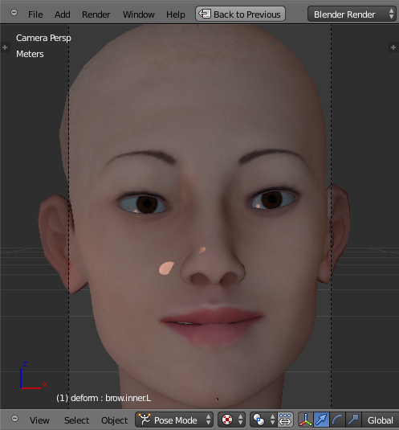

ros-indigo-base
===============
Docker files for Hanson Robotics robots and heads.  The most
sophisticated of the bunch is Eva, an animated female head, capable
of seeing you (via a webcam), talking to you (via a chatbot), and
engaging you (and your guests) in social interaction.  She will
make eye contact, and express her pleasure with smiles and looks
of surprise and happiness.

## Hierarchy and dependents

The docker image hierarchy is:

    ├─ros-indigo-base
      ├─ros-indigo-blender
        ├─eva-owyl
        ├─eva-ros
        ├─ros-arthur-animation
        ├─ros-arthur-dev
        ├─ros-indigo-opencog
      ├─ros-indigo-dev
        ├─ros-indigo-einstein
        ├─ros-indigo-zenorsm

* `base` contains a docker image defining only the basic ROS indigo
   nodes shared by all robots, and nothing more.

* `blender` contains a docker image for ROS and blender. Depends on
   base, above.  it does not provide anything beyond a configured
   ROS+blender environment.

* `eva-ros` contains the basic Hanson Robotics Eva blender rig,
   together with the ROS nodes needed for vision processing.
   Upon startup, it will automatically run the blender rig and the
   vision subsystem.  However, it is missing the chatbot and the
   behavior subsystem; Eva will stare blankly into space and breath,
   but do nothing more.

* `eva-owyl` is a a stand-alone demo of the basic Hanson Robotics
   Eva blender rig, showing the full range of emotional facial
   expressions, ranging from happiness to frustration, excitement
   to boredom, as well as gestures such as shakes, nods, blinks and
   a keep-alive breathing cycle. It includes basic vision processing
   and basic human-face awareness behavior, but without a chatbot or
   any OpenCog processing software.  This is a stand-alone demo,
   without any other dependencies. It is representative of the state
   of development of the Hanson Robotics Eva blender rig, as of
   May 2015.

## Miscellaneous packages

* `dev`, derived from `base`, contains a docker image for a ROS indigo
   development environment.

* `einstein` container for the Hanson Robotics' small Einstein head.
  This container was demoed at ROS Kong 2014 by David Hanson.

* `zenorsm` ... Zeno ?? with Einstein head ??

## Unmaintained images
The arthur-animation and arthur-dev packages are deprecated. They
implement an older animation system that was difficult to work with.
Most importantly, eye-tracking and emotion gestures were not blended
and integrated in an easy-to-use fashion.

* `arthur-animation` contains a demo for the Hanson Robotics Arthur head,
   showing how ROS messages can be used to control facial animations.
   That is, the blender rig is encapsulated in a ROS node; the rig
   reacts to ROS messages.

* `arthur-dev` contains the full end-to-end development environment
   for the Hanson Robotics Arthur head.  This includes a half-dozen
   ROS nodes for camera and vision processing, scripted behavior trees,
   motor controllers, and a web-based user interface.

## Building
Most subdirectories contain a `build.sh` script for building the
particular docker image.

Use `build-all.sh` to build the Eva docker image and it's dependents.
This may take an hour or more.

## Running
Most subdirectories contain a pair of scripts: `run.sh` and `stop.sh`.
These will run and stop the containers defined in that directory.
